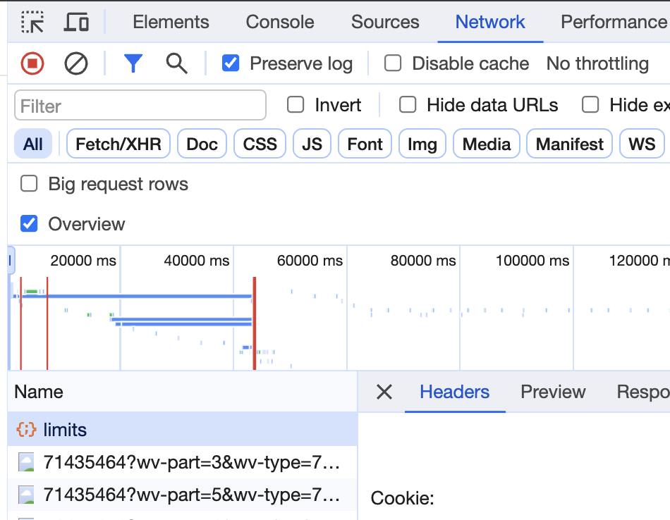

# ⚡ Сервис для успешного закрытия физры в ITMO ⚡

### Телеграм бот @strava_notifier_bot (StravaNotifier) уведомит вас о появлении свободного места на запись для Strava  
#### Но для надежности (или после завершения поддержки бота со стороны автора) вы также можете развернуть его у себя на виртуальной машине

### Содержимое файла .env

`TG_TOKEN=`

`KEYCLOACK_REFRESH_TOKEN=`

* Токен (`TG_TOKEN`) для своего бота вы получаете после создания бота в тг (в инете полно инфы),   
а вот инструкция по получению `KEYCLOACK_REFRESH_TOKEN`:
1. Заходим в панель разработчика -> Network
2. Обновляем страницу и ищем Cookie в запросах, например limits

3. Находим `auth._refresh_token.itmoId=` и записываем в `KEYCLOACK_REFRESH_TOKEN=` в .env файле проекта

Теперь все для проекта есть, осталось перенести проект на виртуалку и запустить через *python main.py* 
*не забудьте создать .env файл на виртуалке, потому что при переносе через гит он будет проигнорирован